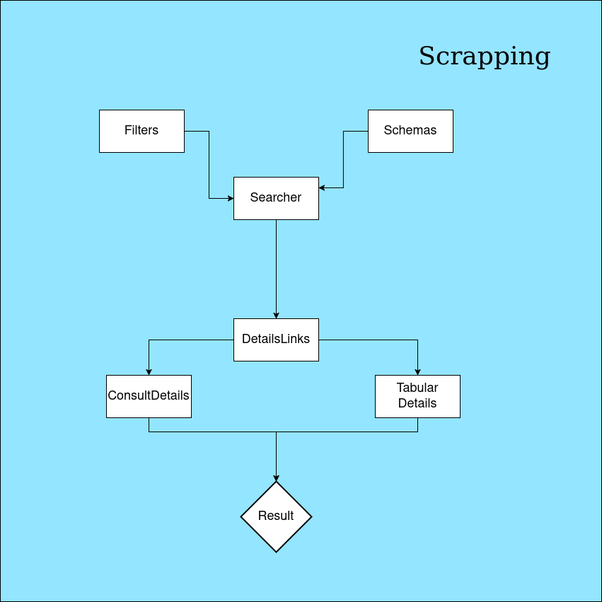
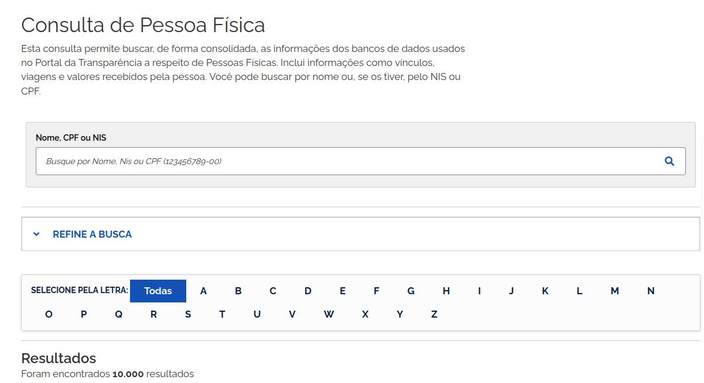
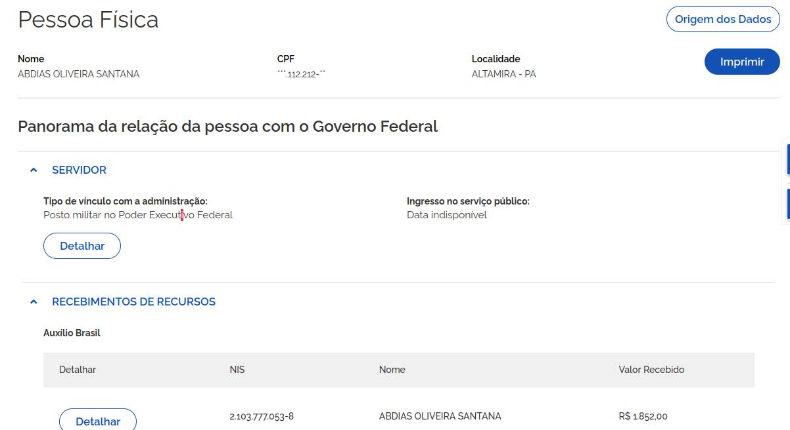
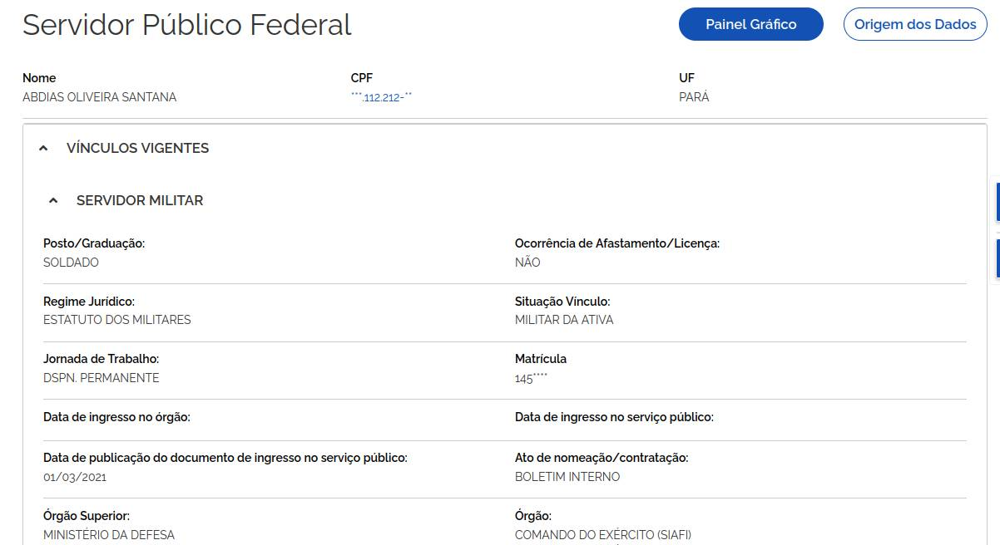
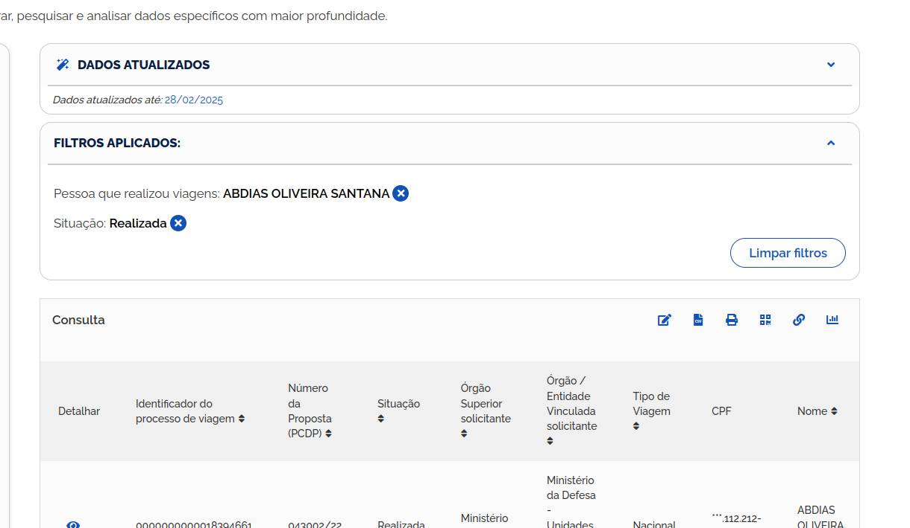

# Portal da Transparência — Robô de Raspagem + API REST

Este projeto é uma solução de raspagem automatizada de dados públicos diretamente do [Portal da Transparência](https://portaldatransparencia.gov.br), utilizando as seguintes tecnologias:

- **Playwright (Python)**: navegação e automação de páginas.
- **FastAPI**: interface RESTful para expor as funcionalidades via HTTP.
- **Google Sheets + Drive**: persistência dos dados extraídos.
- **MkDocs Material**: documentação da aplicação.

## 🔍 Funcionalidades

- Realiza buscas por CPF ou CNPJ no portal.
- Aplica filtros inteligentes com base nos dados disponíveis.
- Coleta dados detalhados (como benefícios recebidos, contratos, sanções, entre outros).
- Exporta e armazena os dados em formato estruturado no Google Sheets e Drive.
- Disponibiliza tudo via uma API REST simples e robusta.

## 🧱 Estrutura do Projeto
A estrutura do projeto é organizada da seguinte forma:

**Core**:  contém a lógica principal de raspagem e manipulação de dados.

**Server**: contém a API FastAPI, que expõe os endpoints para interação com o sistema, assim como a integração com as apis do Google.

<!--  -->

A camada **core** possui toda lógica de raspagem e manipulação de dados, separada por algumas estruturas básicas: **Crawler**, **Filter** e **Selector**. Cada uma dessas estruturas é responsável por uma parte específica do processo de raspagem e exportação dos dados. 

Um **Crawler** tem como principal responsabilidade navegar pelas páginas do portal e interagir com os elementos da interface. Para manter o código robusto, os seletores são definidos em um arquivo separado, permitindo fácil manutenção e atualização, utilizando uma simples `dataclass`. 
Todo o processo de raspagem de dados pode ser separado em quatro telas principais: 

1. **Tela de Busca**: onde o usuário insere o termo de busca e aplica os filtros. Esta tela também é a mesma que possui os resultados da busca, que por sua vez, possui um botão para navegar para a próxima página de resultados.

2. **Tela de Links de Detalhes**: Ao clicar em um dos resultados, uma nova página é aberta, com dados rápidos do resultado e vários botões para navegar para as telas com mais detalhes.

3. **Tela de Detalhes**: Ao clicar em um dos botões da tela de links de detalhes, uma nova página é aberta com os dados detalhados do resultado. Esta por sua vez existe em duas variações: a que chamamos de "Tela de dados Tabelados", e a "Tela de consulta".

    

        
        <caption style="text-align: center; font-size: 14px; color: #555;">Tela de Busca</caption>
    

    

        
        <caption style="text-align: center; font-size: 14px; color: #555;">Tela de Links</caption>
    

    

        
        <caption style="text-align: center; font-size: 14px; color: #555;">Detalhes Tabelados</caption>
    

    

        
        <caption style="text-align: center; font-size: 14px; color: #555;">Tela de Consulta</caption>
    

O projeto foi desenvolvido com o objetivo de ser modular e escalável, permitindo fácil adição de novas funcionalidades e melhorias. Neste sentido, é possível adicionar novos crawlers, filtros e seletores conforme necessário, sem impactar a estrutura existente. Além disso, a utilização de dataclasses para definir os seletores torna o código mais legível e fácil de manter.

Realizar a manutenção de uma tela pode ser feita de modo isolado, ou seja, se houver uma mudança na estrutura de uma tela, o código do crawler não precisa ser alterado. Isso é possível porque a lógica de raspagem e manipulação de dados está separada da lógica de interação com a interface do usuário.

Além disso, o projeto conta com um sistema de logs que permite acompanhar o andamento da raspagem e identificar possíveis erros ou falhas no processo, mecanismos de retry e timeout, tratamentos de exceções e prevenção/deteção de bloqueios por parte do portal, incluindo captchas.

Todo o fluxo de raspagem pode é centralizado atraés da classe `PortalTransparencia`, que possui métodos para iniciar a raspagem, aplicar filtros e exportar os dados. Essa classe é responsável por orquestrar todo o processo de raspagem e garantir que os dados sejam coletados de forma eficiente e precisa.

